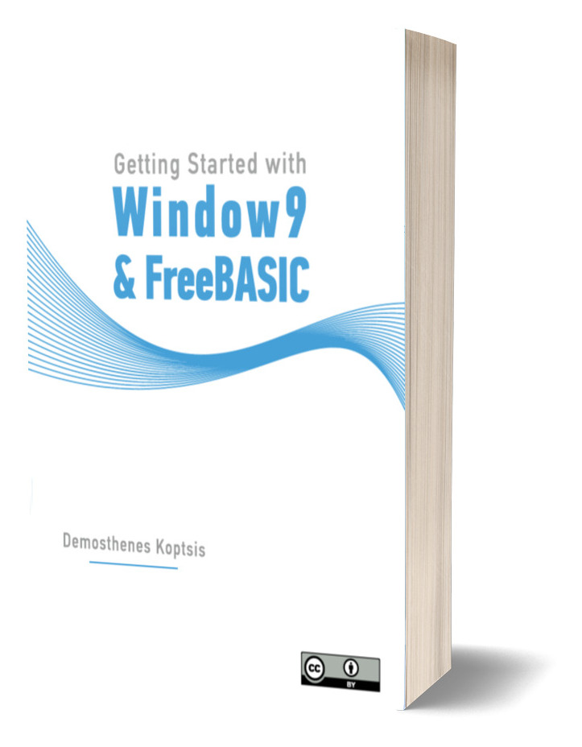

# Getting started with Window9 and FreeBASIC

This is the repository for the free book of Window9 and FreeBASIC.

With this book you will learn how to develop GUI applications with Window9 and FreeBASIC.

Due to Stanislav Budinov and D.J.Peters the developers of Window9 headers for FreeBASIC and Demosthenes Koptsis the author of this book you can learn easily how to master Window9 with the facility of a BASIC language, the crossplatform FreeBASIC.

This repository will contain the pdf and odt files of the book and a number of example code which accompanies the book.

Thanks to [Window9 project](https://sourceforge.net/projects/guiwindow9/), the [FreeBASIC](https://www.freebasic.net/) community and Stanislav Budinov for supporting this work.
